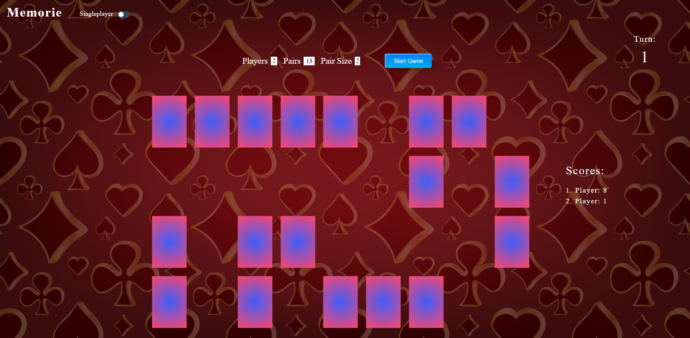

<h1 align="center" id="title">Simple Memory Game</h1>

A simple game of memorie that you can play against as many friends as you want. You can choose the amount of players the amount of card-pairs and how many cards a pair consists of.

<h2>Demo</h2>

[https://bekirtahagd.github.io/memory/](https://bekirtahagd.github.io/memory/)
 

<h2>Features</h2>

*   Dynamic Amount Of Players
*   Dynamic Amount Of Pairs
*   Control of Pair Size
  
<h2>Project Screenshots:</h2>

